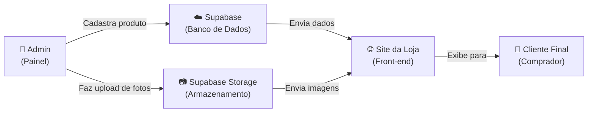
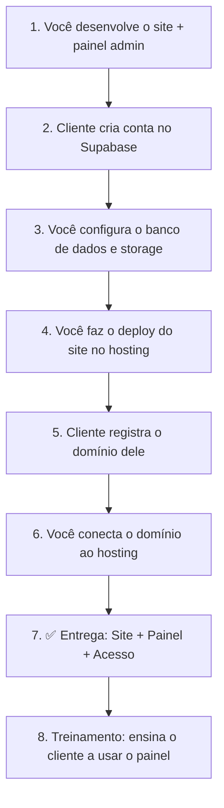

# 🚀 Guia Completo — Painel Admin para Sites de E-commerce

## O que é e por que criar?

Hoje o site da **Infinity Impressões 3D** funciona com os produtos escritos diretamente no código (`products.js`). Para adicionar, editar ou remover um produto, é preciso abrir o código e mexer manualmente.

O objetivo é criar um **Painel Administrativo** (igual ao da Shopify) onde qualquer pessoa consegue:

- ➕ Cadastrar novos produtos com fotos, preço, descrição e tamanhos
- ✏️ Editar produtos existentes
- 🗑️ Excluir produtos
- 📷 Fazer upload de fotos diretamente pelo painel
- 👁️ Ver os produtos publicados no site em tempo real

**Tudo isso sem tocar em uma linha de código.**

---

## 🏗️ Arquitetura do Sistema

### Explicação simples:

| Parte | O que faz | Tecnologia |
|---|---|---|
| **Site da Loja** | O que o comprador vê (produtos, carrinho, etc.) | React + Vite (já temos) |
| **Painel Admin** | Onde o dono da loja gerencia os produtos | React (vamos criar) |
| **Banco de Dados** | Onde ficam guardados os dados dos produtos | Supabase (PostgreSQL) |
| **Storage** | Onde ficam guardadas as fotos dos produtos | Supabase Storage |
| **Autenticação** | Login e senha para acessar o painel | Supabase Auth |

---

## 💰 Supabase — Plano Gratuito

O Supabase é a plataforma que vai guardar os dados e as fotos. Ela é **gratuita** e **não pede cartão de crédito**.

### Limites do plano grátis:

| Recurso | Limite Gratuito | Na prática |
|---|---|---|
| Banco de Dados | 500 MB | ~50.000 produtos cadastrados |
| Storage (fotos) | 1 GB | ~2.000 fotos de produtos |
| Autenticação | 50.000 usuários | Mais do que suficiente |
| API (requisições) | Ilimitada | ✅ Sem limites |
| Projetos | 2 projetos gratuitos | 1 por cliente |

### Quando começa a pagar?

Só quando ultrapassar os limites acima. O plano pago (Pro) custa **US$ 25/mês** (~R$ 130/mês), mas para a maioria dos clientes o plano gratuito vai durar **muito tempo**.

> [!TIP]
> Para um e-commerce pequeno/médio com até 200 produtos e 5.000 visitas/mês, o plano gratuito é mais do que suficiente.

---

## 🔐 Como funciona o Login do Admin

O painel admin será protegido por **email + senha**. Apenas quem tiver as credenciais consegue acessar.

- O dono da loja acessa `seusite.com.br/admin`
- Faz login com email e senha
- Gerencia todos os produtos

> [!IMPORTANT]
> Clientes normais (compradores) **NÃO** veem o painel admin. Ele é totalmente separado e invisível para quem está comprando.

---

## 📋 Funcionalidades do Painel Admin

### Tela: Lista de Produtos
- Tabela com todos os produtos cadastrados
- Foto miniatura, nome, preço, estoque, categoria
- Botões de Editar e Excluir
- Botão "Novo Produto"
- Barra de busca e filtros

### Tela: Criar / Editar Produto
Formulário com os campos:

| Campo | Tipo | Exemplo |
|---|---|---|
| Nome do Produto | Texto | "CAMISETA MANGA LONGA CHROME HEARTS" |
| Preço | Número | 89,90 |
| Preço Antigo (riscado) | Número | 159,90 |
| Desconto | Texto | "44% OFF" |
| Categoria | Seleção | Impressões 3D / Colecionáveis / Camisetas / Tênis |
| Tamanhos | Multi-seleção | P, M, G, GG |
| Cores | Adicionar cores | Nome + Hex + Foto da cor |
| Foto Principal | Upload | Arrasta ou clica para enviar |
| Galeria de Fotos | Upload múltiplo | Até 6 fotos adicionais |
| Descrição | Texto longo | Descrição completa do produto |
| Especificações | Lista | Material: PETG, Dimensões: 18x14cm, etc. |
| Badge/Etiqueta | Texto | "EXCLUSIVO", "HOT", "MAIS VENDIDO" |
| SKU | Texto | "3D-GT3-SUPP" |
| Estoque | Seleção | Em Estoque / Últimas Unidades / Esgotado |
| Produto Destaque? | Sim/Não | Se aparece na home |

### Tela: Dashboard (Resumo)
- Total de produtos cadastrados
- Produtos em destaque
- Último produto adicionado
- Atalhos rápidos

---

## 🏢 Modelo de Negócio — Como Vender Sites

### Quem cria cada conta?

| Conta | Quem cria | Por quê |
|---|---|---|
| **Supabase** | 🟢 **O cliente** | Os dados e fotos são dele |
| **Domínio** (.com.br) | 🟢 **O cliente** | O domínio é propriedade dele |
| **Vercel / Hosting** | 🟡 **Você ou o cliente** | Onde o site fica hospedado |
| **Código fonte** | 🔵 **Você** (desenvolvedor) | Você é o autor do código |

### Fluxo de entrega para o cliente:

### Sugestão de preços para cobrança:

| Serviço | Valor sugerido | Quando cobrar |
|---|---|---|
| **Criação do site completo** | R$ 2.000 ~ R$ 5.000 | Pagamento único |
| **Painel Admin incluso** | (incluso no valor acima) | — |
| **Manutenção mensal** | R$ 150 ~ R$ 300/mês | Recorrente |
| **Alterações extras** | R$ 50 ~ R$ 150/hora | Sob demanda |
| **Treinamento do painel** | R$ 100 ~ R$ 200 | Único (1~2 horas) |

> [!TIP]
> A manutenção mensal é onde está o **dinheiro recorrente**. Mesmo que o cliente não peça nada, você cobra por "estar disponível" para suporte, atualizações de segurança e garantia de funcionamento.

---

## 🛠️ O que precisa ser feito (Etapas)

### Etapa 1 — Criar conta no Supabase
- Acessar [supabase.com](https://supabase.com)
- Criar conta com Google ou email
- Criar um novo projeto (ex: "infinity-3d")
- Anotar as credenciais: **URL do projeto** e **chave anon (pública)**

### Etapa 2 — Configurar o Banco de Dados
Eu vou criar as tabelas automaticamente:
- `products` — dados dos produtos
- `product_images` — galeria de fotos
- `product_colors` — variantes de cor
- `product_specs` — especificações técnicas
- `categories` — categorias

### Etapa 3 — Configurar o Storage
- Criar bucket `product-images` para fotos
- Configurar permissões (público para leitura, privado para upload)

### Etapa 4 — Criar o Painel Admin
- Tela de login
- Dashboard com resumo
- CRUD completo de produtos (Criar, Ler, Atualizar, Deletar)
- Upload de imagens com preview
- Formulário completo com todos os campos

### Etapa 5 — Conectar o Site da Loja ao Supabase
- O site da loja vai ler os produtos do banco de dados (em vez do arquivo `products.js`)
- Fotos vêm do Supabase Storage
- Tudo atualiza em tempo real

### Etapa 6 — Deploy e Entrega
- Fazer deploy do site no Vercel ou Netlify (gratuito)
- Conectar o domínio do cliente
- Testar tudo
- Treinar o cliente

---

## ✅ Resultado Final

Depois de pronto, o fluxo do dono da loja será:

1. Acessa `seusite.com.br/admin`
2. Faz login com email e senha
3. Clica em **"Novo Produto"**
4. Preenche nome, preço, descrição, tamanhos
5. Faz upload das fotos
6. Clica em **"Publicar"**
7. ✅ O produto aparece **instantaneamente** no site da loja

**Sem código. Sem complicação. Igual Shopify, mas 100% seu.**

---

## ⚠️ O que o painel admin NÃO faz (por enquanto)

Esses recursos podem ser adicionados no futuro:

- ❌ Processar pagamentos (precisa integrar Stripe, Mercado Pago, etc.)
- ❌ Gestão de pedidos e vendas
- ❌ Controle de estoque automático
- ❌ Envio de emails para clientes
- ❌ Cupons de desconto dinâmicos
- ❌ Analytics e relatórios de vendas

> [!NOTE]
> Cada um desses pode ser adicionado depois como módulo extra. O importante é começar com o cadastro de produtos funcionando.

---

## 🎯 Próximo Passo

Para começar, basta:

1. **Criar uma conta** no [Supabase](https://supabase.com) (para testes, depois cria outra para o cliente)
2. **Me enviar** a URL do projeto e a chave `anon` pública
3. Eu configuro tudo e crio o painel admin completo

Tempo estimado de desenvolvimento: **1 sessão de trabalho** (~2-4 horas).
